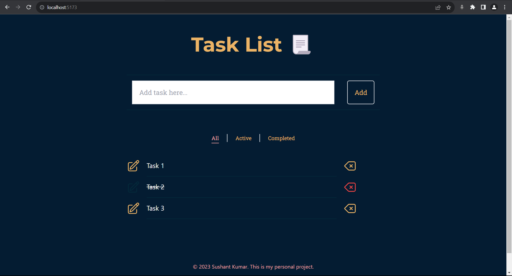

# Task List📋

## Description 📝

The **Task List** is a web application built using **Vue 3** and the **Vue 3 Composition API**. It allows users to manage their tasks with features such as adding, deleting, and marking tasks as completed. The application provides a user-friendly interface for task management.

## Table of Contents 📌

- [Task List📋](#task-list)
  - [Description 📝](#description-)
  - [Table of Contents 📌](#table-of-contents-)
  - [Features 🎯](#features-)
  - [Screenshots 🖼️](#screenshots-️)
  - [Installation 🚀](#installation-)
  - [Usage 🔧](#usage-)
  - [Technologies Used ⚙️](#technologies-used-️)
  - [Project Structure 📂](#project-structure-)
  - [License 📄](#license-)
  - [Acknowledgments 🙏](#acknowledgments-)
  - [Contributing 🤝](#contributing-)

## Features 🎯

- **Task Creation:** Users can add new tasks to the list by entering task titles and clicking the "Add" button.

- **Task Deletion:** Tasks can be deleted by clicking the delete button associated with each task.

- **Task Completion:** Users can mark tasks as complete or incomplete by clicking the checkbox icon.

- **Task Filtering:** The application supports task filtering based on completion status, allowing users to view all tasks, active tasks, or completed tasks.

## Screenshots 🖼️



## Installation 🚀

1. Clone this repository to your local machine:

   ```bash
   git clone https://github.com/your-username/task-list.git

   ```

2. Navigate to the project directory

   ```bash
   cd task-list

   ```

3. Install dependencies

   ```bash
   npm install

   ```

4. Start development server

   ```bash
   npm run dev

   ```

5. Open your web browser and visit http://localhost:5173 to use the application.

## Usage 🔧

- Use the input field to add new tasks to your task list.
- Click the delete button to remove a task.
- Click the checkbox icon to mark a task as complete or incomplete.
- Use the tabs to filter tasks by all, active, or completed.

## Technologies Used ⚙️

- Vue 3
- Vue 3 Composition API
- Vite (Build Tool)
- Tailwind CSS

## Project Structure 📂

The project structure is organized as follows:

- `components`: Contains Vue components for Header, Footer, CreateTasks, TaskList, TabsWrapper, and Tab.
- `views`: Contains Vue components for TabsWrapper and Tab.
- `utils`: Contains functions for task management.
- `style.css`: Contains CSS styles for the application.

## License 📄

This project is licensed under the MIT License - see the [LICENSE](LICENSE) file for details.

## Acknowledgments 🙏

This project was created for learning purposes and as a demonstration of Vue 3 and the Composition API.

## Contributing 🤝

Contributions are welcome! If you'd like to contribute to this project, please open an issue or submit a pull request.
